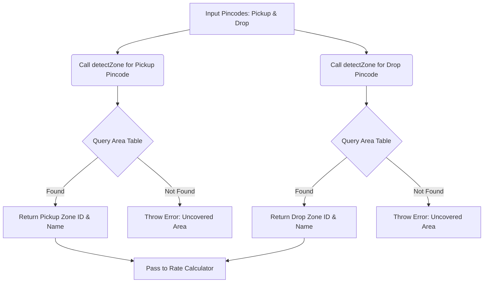
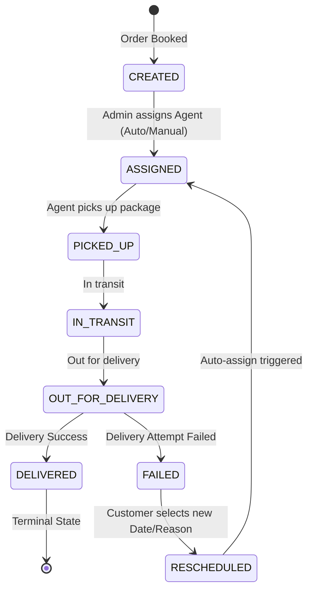

# System Architecture & Design Specification: Last-Mile Delivery Tracker

This document provides a comprehensive technical overview of the system architecture, business rules, and core algorithm designs implemented in the Last-Mile Delivery Tracker platform.

---

## 1. Rate Calculation Engine

The rate calculation engine is the financial core of the platform, designed to dynamically compute shipping charges based on package dimensional volume, physical mass, customer segments, and geographical routes. 

### The Core Algorithms and Formulas

1. **Dimensional vs. Mass Billing (Volumetric Weight)**:
   In logistics, cargo volume is often as costly to transport as weight. The system employs a standardized volumetric conversion ratio to ensure bulky, lightweight packages are priced fairly:
   $$\text{Volumetric Weight (kg)} = \frac{\text{Length (cm)} \times \text{Breadth (cm)} \times \text{Height (cm)}}{5000}$$
   The resulting value is rounded to exactly two decimal places.

2. **Billed Weight Determination**:
   To prevent revenue leakage on low-density shipments, the billing engine evaluates both weight profiles and charges based on the dominant profile:
   $$\text{Billed Weight} = \max(\text{Actual Weight}, \text{Volumetric Weight})$$
   This ensures that a large box of pillows weighing 2 kg (but with a volumetric weight of 12 kg) is billed at 12 kg, while a compact 10 kg iron barbell is billed at 10 kg.

3. **Zone-Pair Pricing Lookup**:
   The engine maps the source and destination to their respective geographical zones (e.g., `Zone-North`, `Zone-South`). A unique index is queried in the `RateCard` table containing:
   - `zoneFromId`: The pickup zone identifier.
   - `zoneToId`: The drop zone identifier.
   - `orderType`: The segment type (`B2B` or `B2C`). B2B clients enjoy discounted bulk shipping rates compared to individual B2C clients.
   
   If the pickup and drop zones match, the shipment is classified as **Intra-zone** (local delivery, e.g., ₹30/kg for B2C). If they differ, it is classified as **Inter-zone** (long-distance delivery, e.g., ₹50/kg for B2C).

4. **Surcharge Application**:
   Cash on Delivery (COD) requires courier agents to handle cash collections, introducing risk and administrative overhead. The system dynamically applies a flat COD surcharge (configured on the matching rate card, e.g., ₹25) if `paymentType === 'COD'`. Prepaid shipments are exempted from this fee.

5. **Accumulation**:
   The total charge is aggregated and rounded to two decimals:
   $$\text{Total Charge} = (\text{Billed Weight} \times \text{Rate per kg}) + \text{COD Surcharge}$$

---

## 2. Zone Detection Approach

To automate route planning and pricing, the application implements a deterministic pincode-to-zone resolver. 

### The Resolver Flow: `detectZone(pincode)`

- **Area Mapping Table**: Pincodes are not directly associated with coordinates; instead, the database contains an `Area` model. Each area has a unique `pincode` (e.g. `110001`) and is linked to exactly one parent `Zone` via `zoneId`.
- **Double Resolution**: During calculation, `detectZone()` is called twice:
  1. Once for the `pickupPincode` to obtain the `pickupZoneId`.
  2. Once for the `dropPincode` to obtain the `dropZoneId`.
- **Validation and Coverage Guards**: If a customer inputs a pincode that does not exist in the `Area` table, the resolver throws a descriptive validation error (e.g., `No zone found for pincode 999999`). This acts as an automated serviceability guard, preventing orders from being placed for regions outside the company's coverage zones.

---

## 3. Auto-Assignment Logic

The dispatch system is designed to minimize agent transit times and balance workloads by assigning shipments to the closest eligible courier.

### Routing Logic in `agentAssigner.js`

When an order enters a status ready for assignment (`CREATED` or `RESCHEDULED`), the auto-assign algorithm executes a two-tiered check:

1. **Zone-First Check**:
   The algorithm queries the database for any `Agent` who satisfies:
   - `status === 'AVAILABLE'`
   - `currentZoneId === dropZoneId` (the destination zone of the order)
   
   Assigning an agent who is already located in the drop zone ensures they are positioned close to the delivery point, reducing empty run times.

2. **Global Fallback Check**:
   If no available agent is located in that specific drop zone, the algorithm relaxes the zone constraint and searches for any agent with `status === 'AVAILABLE'` across the entire network.

3. **Assignment Transaction**:
   Once an agent is found, the system performs an atomic transaction:
   - Sets `Order.agentProfileId` and `Order.agentId` to bind the agent to the shipment.
   - Transitions `Order.status` to `ASSIGNED`.
   - Transitions `Agent.status` to `BUSY`.
   
   If no agent is available anywhere, the system throws a `No available agents` error, leaving the order in its current state (`CREATED` or `RESCHEDULED`) for manual routing later.

---

## 4. Failed Delivery Handling & Rescheduling Flow

The system implements a robust state machine for failed deliveries, providing a self-service correction loop for customers while optimizing agent utilization.

### Detailed Lifecycle State Transitions

1. **The Failure Trigger**:
   If a courier cannot deliver a package (e.g., locked gate, incorrect address), they transition the order status to `FAILED` via their portal, submitting a note describing the problem and a tentative reschedule date.
   - The order status updates to `FAILED`.
   - A `TrackingLog` is written recording the event details.
   - An entry is created in the `Reschedule` table.
   - **Crucially**, the agent's status is reverted back to `AVAILABLE`, freeing them up to perform other deliveries immediately.
   - A notification email is dispatched informing the customer of the failed attempt.

2. **Customer Correction (Rescheduling)**:
   The customer views their order tracking page, which displays a warning banner and a reschedule form. The customer inputs a preferred future date and provides a reason/instructions.
   - Submitting the form calls `POST /api/orders/:id/reschedule`.
   - The status transitions to `RESCHEDULED`.
   - A new `Reschedule` record is created.
   - A `TrackingLog` entry is appended.

3. **Automated Re-Dispatch**:
   Immediately upon transitioning to `RESCHEDULED`, the backend triggers the `autoAssign` service. The system attempts to assign the order to an available agent in the drop zone for the new date.
   - If successful, the order transitions immediately from `RESCHEDULED` to `ASSIGNED`, securing an agent.
   - If no agents are available, the order remains in `RESCHEDULED` status, allowing the Admin to manually route it through their dashboard.
